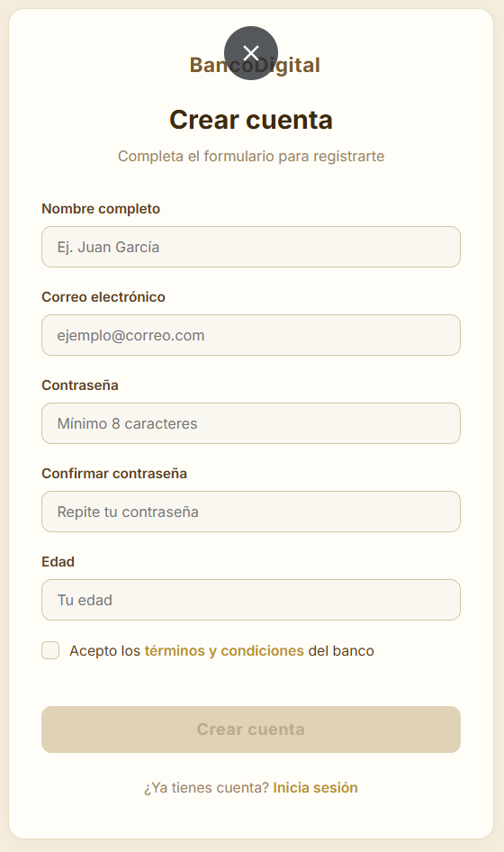
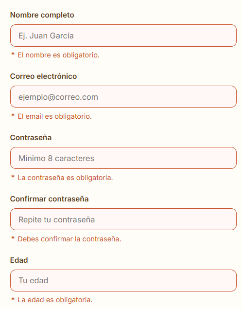
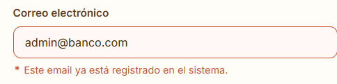
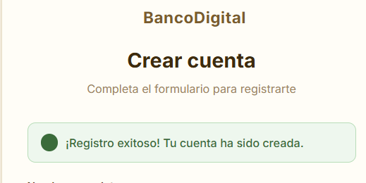

# FormulariosAvanzados

User registration form for a digital bank built with Angular Reactive Forms. Validates all fields in real time, blocks invalid submissions, and simulates an API call on submit.

---

## Screenshots

**Form — general view**



**Validation errors**



**Async email validation**



**Success message after submit**



---

## Features

- Real-time validation with specific error messages per field
- Custom validator: password confirmation (cross-field)
- Custom validator: minimum age of 18
- Async validator: simulated email availability check (800 ms delay)
- Errors only appear after the user has touched or modified a field
- Submit button stays disabled while the form is invalid
- Password strength indicator (Weak / Medium / Strong)
- Show/hide password toggle
- Form resets after a successful submission
- Simulated API call with `setTimeout`

---

## Fields and Rules

| Field | Rules |
|---|---|
| Name | Required. 3–50 characters. Letters and spaces only. |
| Email | Required. Valid format. Blocked addresses: `admin@banco.com`, `usuario@banco.com`, `test@test.com`. |
| Password | Required. Min. 8 characters. Must include uppercase, lowercase, and a number. |
| Confirm Password | Must match the password field. |
| Age | Required. Must be 18 or older. |
| Terms | Must be accepted. |

---

## Project Structure

```
src/app/
  registro/
    registro.component.ts     # Form logic and submit handler
    registro.component.html   # Template with bindings and error messages
    registro.component.css    # Component styles
    validators.ts             # Custom and async validators
  app.ts                      # Root component
images/                       # Screenshots for this README
```

---

## Getting Started

```bash
# Clone the repository
git clone https://github.com/JoyMoGas/AdvancedForms.git
cd AdvancedForms

# Install dependencies
npm install

# Start the development server
npm start
```

App runs at `http://localhost:4200`.

---

## Notes

- Built with the Angular standalone component API (no `NgModule`).
- Font Awesome 6 loaded via CDN for icons.
- The async email validator fires only on `blur` to avoid unnecessary requests while typing.
